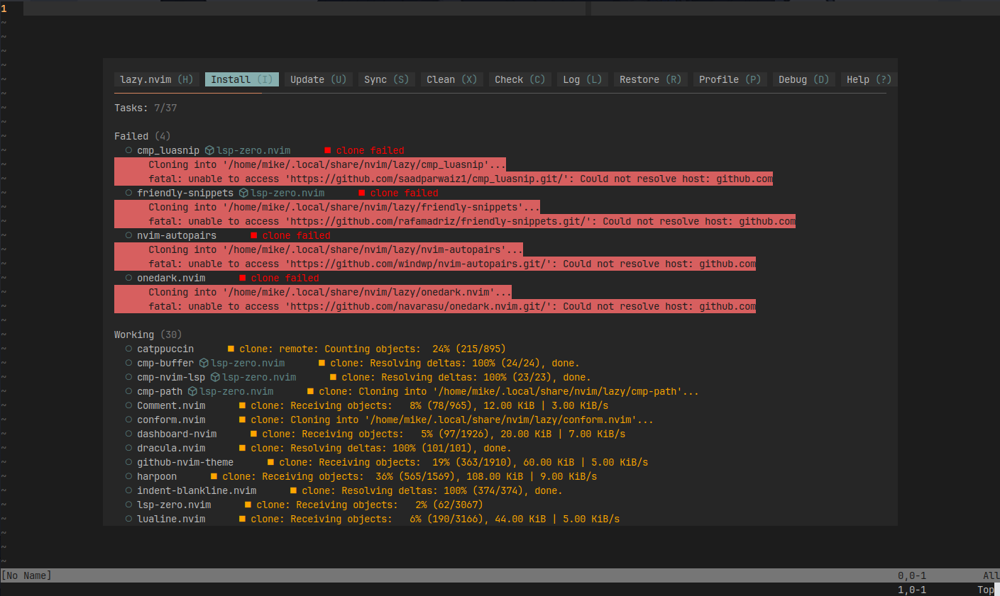

## Neovim Config


[_screenshots_](./SCREENSHOTS.md)

__Dependencies:__

- [neovim](https://neovim.io/) >= v0.9.5
- [node-js](https://nodejs.org)
- [ripgrep](https://github.com/BurntSushi/ripgrep)
- [a nerd font](https://nerdfonts.com/)


__Installation:__

```bash
git clone https://github.com/m2x07/nvim-config $HOME/.config/nvim
```

> After cloning, wait a few seconds for Neovim's first launch as Lazy plugin manager installs all plugins.

__Troubleshooting:__

1. If you see the below error on first start, wait until only "failed" ones remain. Once only "failed" \
ones remain, press `I` and it'll try to install the remaining ones again. Repeat this if required.


2. If you get the error "failed to install parser", make sure you have a working internet connection, \
node-js installed on your system. After that, re-open neovim.

___

_For any suggestions/corrections/additions, open a PR_
