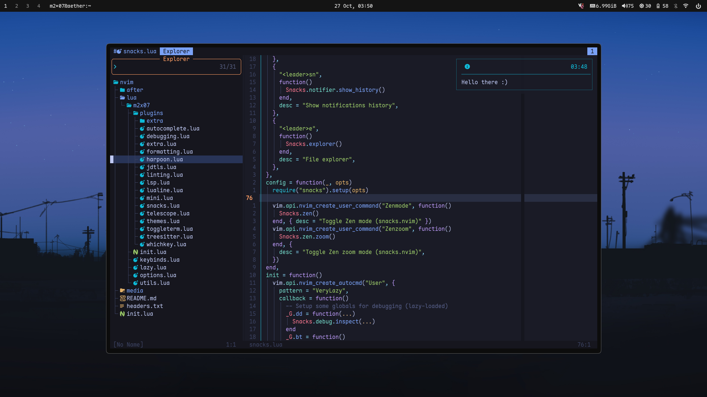

<div align="center">
<h1>My Neovim Configuration</h2>


</div>

## ✨ Features

-   File Explorer
-   Beautiful Themes
-   Fuzzy Finding, Find by Grep...
-   Snippets, Auto-Complete, Formatting & more...
-   Goto definitions, Auto imports, Code actions & more...

## ⚡ Dependencies

-   `git`
-   `curl` or `wget`
-   `unzip`
-   GNU tar `tar` or `gtar`
-   `gzip`
-   `nodejs`
-   `fg`
-   `ripgrep`

## 🚀 Install

```bash
git clone https://github.com/m2x07/nvim-config $HOME/.config/nvim
```

Run `:checkhealth` after installing

## ⚙️ Configuration

-   Each plugin's spec lives in its own file under `lua/m2x07/plugins`, which is our plugin directory
-   To add a new plugin, create a new file inside the plugin dir by the name
    `<your_plugin>.lua`.
-   If the plugin requires very minimal or no config, you can put it inside of
    `extra.lua` file keep the directory structure clean

<sub><sup><i>Feel free to open a PR for anything :)</i><sup></sub>
